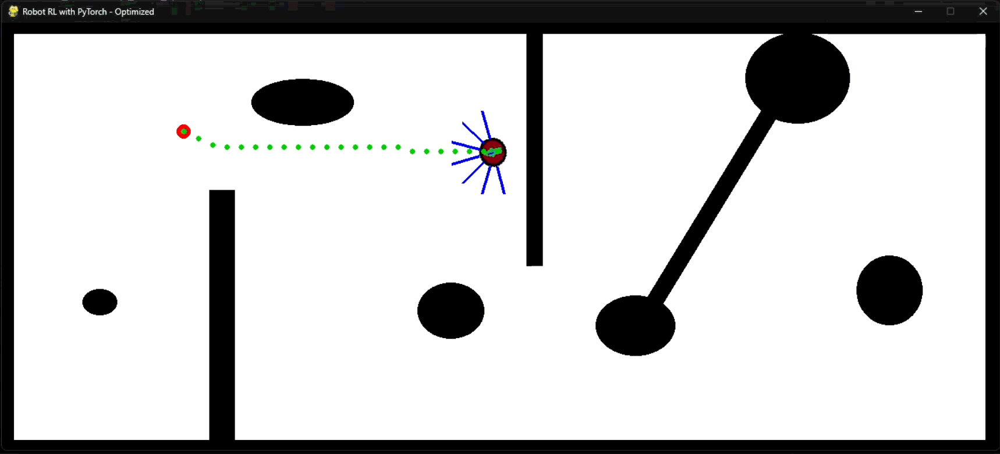
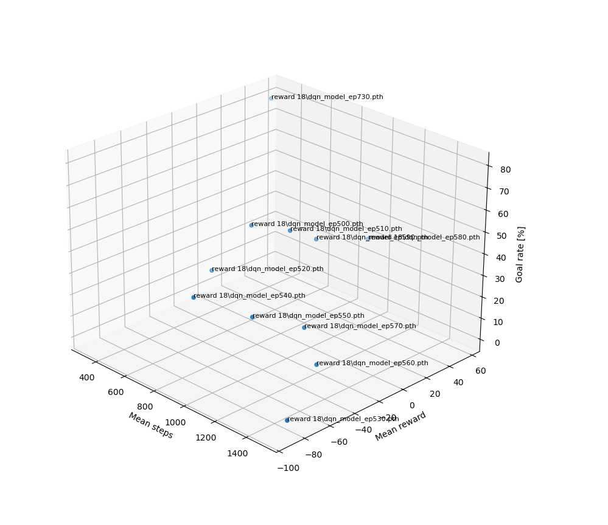
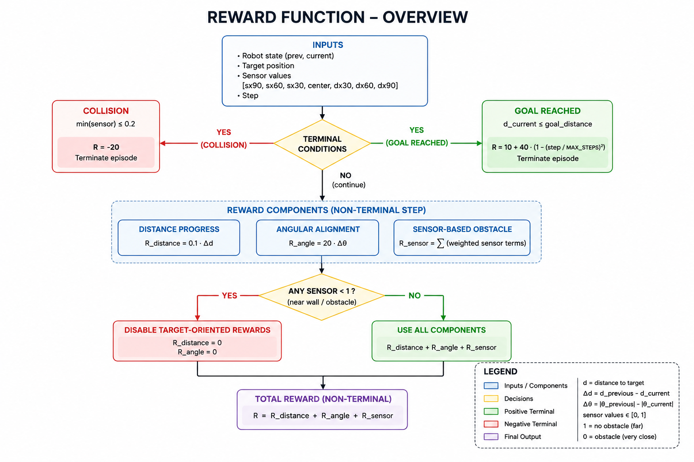

<p align="center">
  
</p>

# 2D-Robot-AI-navigation
Autonomous robot navigation system with A* path planning, DDQN local policy, and LIDAR-based perception on configurable 2D maps.


This project implements a reinforcement learning agent based on Double Deep Q-Networks (DDQN) to solve a 2D robot navigation task in a simulated environment built with Pygame.

The robot learns to navigate a structured environment, avoid obstacles, and reach target goals through trial-and-error learning driven by a reward system.

The project combines:

* Reinforcement Learning (DDQN)
* Path planning (A* integration)
* Custom simulation environment (Pygame)
* Training, evaluation, and rendering pipelines

---

## Key Features

* Double Deep Q-Learning agent implemented from scratch
* Custom 2D environment with obstacles and goals
* Reward-based learning system
* Training and evaluation scripts separated
* Visual rendering of agent behavior

---

## Project Structure

```
.
├── DQNAgent.py                 # Deep Q-Network agent implementation
├── Environment.py              # Custom RL environment (state, reward, transitions)
├── robot.py                    # Robot entity logic
├── astar.py                    # A* pathfinding implementation
├── config.py                   # Hyperparameters and configuration
├── utils.py                    # Helper functions
│
├── ROBOT_TRAINING.py           # Training pipeline
├── ROBOT_RENDER.py             # Visualization / rendering mode
├── ROBOT_TEST_REWARD.py        # Evaluation with reward tracking
├── ROBOT_AUTOMATIC_TESTER.py   # Automated testing loop
│
├── main.py                     # Main entry point
```

---

## Core Components

### 1. DQNAgent

Implements a Double Deep Q-Network that:

* Approximates Q-values for state-action pairs
* Uses experience replay (state, action, reward, next_state, done)
* Learns via Bellman equation updates
* Uses ε-greedy strategy

---

### 2. Environment

Custom simulation environment that:

* Defines the state space (robot position, goal, obstacles)
* Computes rewards based on actions
* Handles collisions and episode termination

---

### 3. Robot
 
Represents the agent inside the environment:

* Executes actions (movement)
* Interacts with environment state
* Receives feedback through rewards

---

### 4. A* Pathfinding

Used as:

* Baseline deterministic navigation method
* Possible comparison against learned policy
* Optional hybrid guidance system

---

### 5. Training Pipeline

`ROBOT_TRAINING.py`:

* Runs multiple episodes
* Updates DQN model
* Stores checkpoints

---

### 6. Evaluation & Rendering

* `ROBOT_TRAINING.py`: trains the DDQN agent through multiple episodes and saves the trained networks without rendering.
* `ROBOT_TEST_REWARD.py`: evaluates the robot's reward and performance through a simulation with human control.
* `ROBOT_RENDER.py`: loads a selected trained network and visualizes the robot's autonomous behavior.
* `ROBOT_AUTOMATIC_TESTER.py`: automatically evaluates all saved networks in a selected directory and generates a 3D plot of steps, reward, and goal completion rate.
* `main.py`: main entry point used to select and launch the training, testing, rendering, or automatic evaluation mode.
* `network_results.png`: visualization comparing the performance of the saved networks.
<p align="center">
  
</p> 

---

## 7. Reward Flowchart

<p align="center">
  
</p> 

The function computes the robot’s reward based on target progress, target alignment, and sensor readings.

* `Goal`: If the robot reaches the target (dist_curr <= goal_distance), the episode terminates with a positive, step-dependent reward.
* `Collision`: If any sensor detects an obstacle within 0.2, the episode terminates with a reward of -20.
* `Distance reward`: Proportional to the reduction in distance to the target: 0.1 × Δdistance.
* `Angular reward`: Proportional to the reduction in the absolute angle between the robot heading and the target direction: 20 × Δangle.
* `Sensor reward`: Combines weighted contributions from the seven sensors, encouraging specific spatial configurations relative to obstacles.
* `Wall handling`: If any sensor detects a wall within 1 unit, both distance and angular rewards are disabled, making the sensor-based term dominant.
* `Neutral sensor state`: If all sensors measure exactly 1, the sensor reward is set to zero.

The final reward is: Reward = Distance Reward + Angular Reward + Sensor Reward

---

## 8. Training Process: Training and Evaluation Strategy

A fundamental aspect of this project is the **separation between the learning phase and path planning**.

During training, at each episode, **one of the available rooms is randomly selected**, together with a **random starting position** and a **random goal position**. As a result, both the environment and the navigation configuration can change from one episode to another, exposing the DDQN agent to a wide variety of navigation scenarios. **A* is not used during training and does not provide any supervision, target path, or action to the agent.** The DDQN learns its navigation policy exclusively through interaction with the environment, using the observations it receives, the rewards, and the experience collected through experience replay.

During evaluation, the trained policy is tested in a **room that was not used during training**. A starting position and a goal position are defined for the test scenario. A* is then used independently to compute a global path from the starting position to the goal. The resulting path is divided into a sequence of intermediate reference points (**green points**), which provide the robot with a global direction to follow.

The DDQN **does not learn or reproduce the path calculated by A***. Its role remains to handle **local navigation and obstacle avoidance**, while progressively attempting to reach the reference points generated from the global path. This setup allows us to evaluate whether the learned policy can **generalize to a room that was not seen during training**, while maintaining a deterministic global reference provided by A*.

The roles of the two algorithms are therefore clearly separated:

* **DDQN:** learns local navigation and obstacle avoidance during training through interaction with continuously varying environments and configurations.
* **A*:** is used **exclusively during evaluation** to calculate the global path and generate the intermediate reference points.

So the agent learns through:

1. Observing environment state
2. Selecting actions (exploration vs exploitation)
3. Receiving rewards
4. Updating Q-network using gradient descent
5. Repeating over multiple episodes

---

## 9. Output

The model produces:

* Trained policy network (`.pth` checkpoints)
* Performance metrics over episodes
* Visual demonstrations of learned navigation

---

## Requirements

Typical dependencies:

```
numpy
pygame
torch
matplotlib
Pillow
```

---

## How to Run

### Training

```bash
python ROBOT_TRAINING.py
```

### Testing

```bash
python ROBOT_TEST_REWARD.py
```

### Choosing the best neural network

```bash
python ROBOT_AUTOMATIC_TESTER.py
```

### Visualization

```bash
python ROBOT_RENDER.py
```

---

## Notes

* This project is experimental and intended for reinforcement learning study.
* Performance depends heavily on reward tuning and environment design.

---

## Author

Personal project focused on reinforcement learning, path planning, and autonomous navigation in simulated environments.
